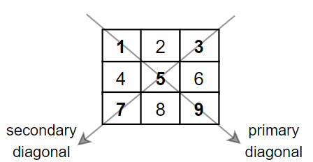

# PSE 7 - Matrix Diagonal Sum

## Given this problem prompt:

Given a square matrix mat, return the sum of the matrix diagonals.

Only include the sum of all the elements on the primary diagonal and all the elements on the secondary diagonal that are not part of the primary diagonal.

Sourced from:  [Leetcode](https://leetcode.com/problems/matrix-diagonal-sum/)

## Answer the following prompts:

<!-- >>>>>>>>>>>>>>>>>>>>>> BEGIN CHALLENGE >>>>>>>>>>>>>>>>>>>>>> -->
<!-- Replace everything in square brackets [] and remove brackets  -->

### !challenge

* type: paragraph
* id: 05da6833-1c6c-4514-a3fc-60b0705c0f56
* title: List at least 5 questions whose answers would clarify the problem statement
* points: 1
* topics: pse

##### !question

List at least 5 questions whose answers would clarify the problem statement.

##### !end-question

##### !placeholder

Give five clarifying questions.

##### !end-placeholder

<!-- other optional sections -->
<!-- !hint - !end-hint (markdown, users can see after a failed attempt) -->
<!-- !rubric - !end-rubric (markdown, instructors can see while scoring a checkpoint) -->
##### !explanation

Some sample clarifying questions could be:

1.  Is there some pattern required for the student ids?
1.  What key-value pairs should the hashes contain?
1.  What should happen if the array of names is empty?
1.  Can id numbers be negative?
1.  Should ids be Integers or can they be floats?

##### !end-explanation

### !end-challenge

<!-- ======================= END CHALLENGE ======================= -->

<!-- >>>>>>>>>>>>>>>>>>>>>> BEGIN CHALLENGE >>>>>>>>>>>>>>>>>>>>>> -->
<!-- Replace everything in square brackets [] and remove brackets  -->

### !challenge

* type: paragraph
* id: a82149b6-0d56-4c8c-97d1-24cce6f6e5ef
* title: List 2 sets of example inputs and their expected output
* points: 1
* topics: pse

##### !question

List 2 sets of example inputs and their expected output.

##### !end-question

##### !placeholder

Two sets of input and their expected output.

##### !end-placeholder

<!-- other optional sections -->
<!-- !hint - !end-hint (markdown, users can see after a failed attempt) -->
<!-- !rubric - !end-rubric (markdown, instructors can see while scoring a checkpoint) -->

### !end-challenge

<!-- ======================= END CHALLENGE ======================= -->

<!-- >>>>>>>>>>>>>>>>>>>>>> BEGIN CHALLENGE >>>>>>>>>>>>>>>>>>>>>> -->
<!-- Replace everything in square brackets [] and remove brackets  -->

### !challenge

* type: paragraph
* id: fc101f5b-a3d8-4c04-b134-d567ca16d19e
* title: Two subproblems
* points: 1
* topics: pse

##### !question

Divide the project prompt into at least 2 different sub-problems.

##### !end-question

##### !placeholder

Two subproblems

##### !end-placeholder

<!-- other optional sections -->
<!-- !hint - !end-hint (markdown, users can see after a failed attempt) -->
<!-- !rubric - !end-rubric (markdown, instructors can see while scoring a checkpoint) -->
##### !explanation

##### !end-explanation

### !end-challenge

<!-- ======================= END CHALLENGE ======================= -->

<!-- >>>>>>>>>>>>>>>>>>>>>> BEGIN CHALLENGE >>>>>>>>>>>>>>>>>>>>>> -->
<!-- Replace everything in square brackets [] and remove brackets  -->

### !challenge

* type: paragraph
* id: 42007b54-70d6-4fe9-8e77-fd3dd856adb6
* title: How to solve a subproblem
* points: 1
* topics: pse

##### !question

Pick one of those problems from #3 and write a numbered list explaining how to solve that problem without using full lines of code.

##### !end-question

##### !placeholder

Steps to solve a subproblem

##### !end-placeholder

<!-- other optional sections -->
<!-- !hint - !end-hint (markdown, users can see after a failed attempt) -->
<!-- !rubric - !end-rubric (markdown, instructors can see while scoring a checkpoint) -->
<!-- !explanation - !end-explanation (markdown, students can see after answering correctly) -->

### !end-challenge

<!-- ======================= END CHALLENGE ======================= -->

<!-- >>>>>>>>>>>>>>>>>>>>>> BEGIN CHALLENGE >>>>>>>>>>>>>>>>>>>>>> -->
<!-- Replace everything in square brackets [] and remove brackets  -->

### !challenge

* type: paragraph
* id: 67f53e92-e335-44ab-8e81-6080ae475cdc
* title: Code to solve the subproblem
* points: 1
* topics: pse

##### !question

Write down a solution for your answer in #4 in code here

##### !end-question

##### !placeholder

Code solution to a subproblem

##### !end-placeholder

<!-- other optional sections -->
<!-- !hint - !end-hint (markdown, users can see after a failed attempt) -->
<!-- !rubric - !end-rubric (markdown, instructors can see while scoring a checkpoint) -->
<!-- !explanation - !end-explanation (markdown, students can see after answering correctly) -->

### !end-challenge

<!-- ======================= END CHALLENGE ======================= -->

## Reminders

- Finish this assignment individually.
- The instructor will collect this at the beginning of the next lesson.
- If you'd like a full list of our tips, hints, and notes, please bring up the document "[About Problem Solving Exercises](../00-about-pses/01-about-pses.md)" in unit.
